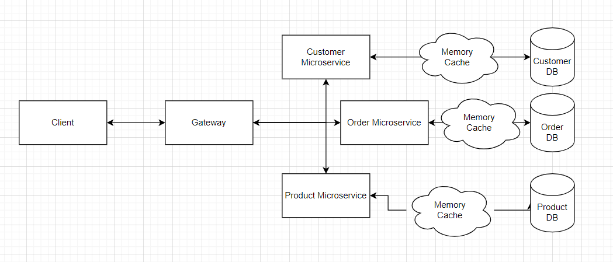
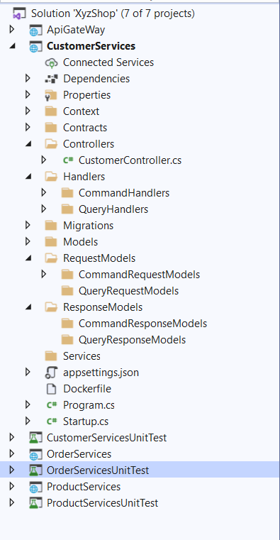
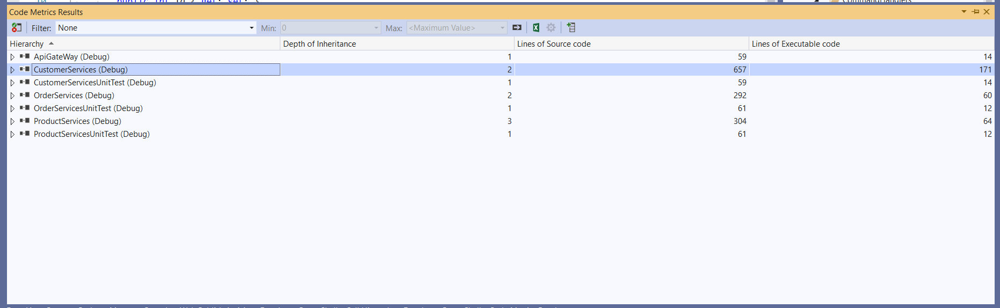
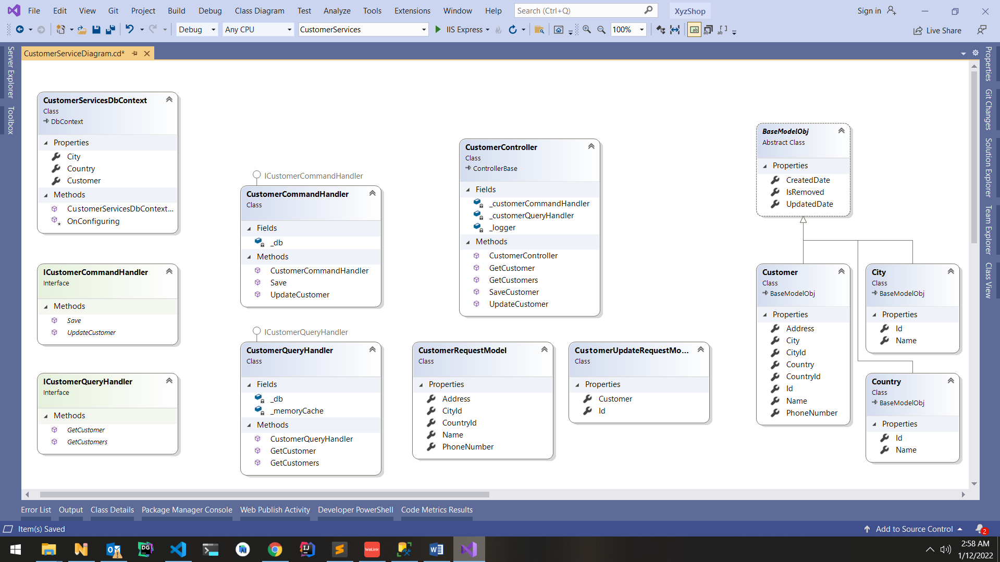
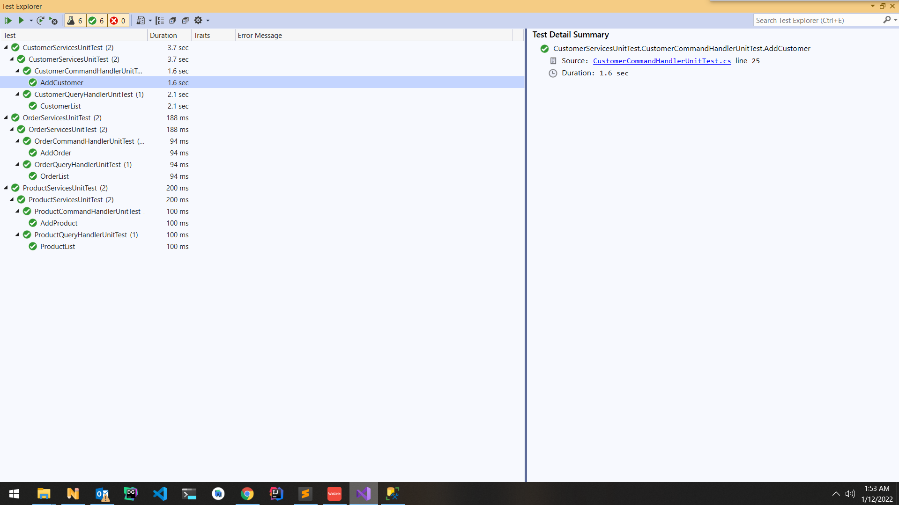

## XYZ Shop Microservices
-----

Design
------



>Project Structer
-------
**Every microservice has DockerFile**




** Lint StyleCop Analyzers **



>Urls
-----
**Api Gateway:** http://localhost:9067
**Customer Service:** {gateway}/customer-service
**Order Service:** {gateway}/order-service
**Product Service:** {gateway}/product-service

**Please read: ocelot.json for gateway detail**
```
{
  "Routes": [
    {
      "DownstreamPathTemplate": "/api/v1/customer",
      "DownstreamScheme": "http",
      "DownstreamHostAndPorts": [
        {
          "Host": "localhost",
          "Port": 4345
        }
      ],
      "UpstreamPathTemplate": "/customer-service"
    },
    {
      "DownstreamPathTemplate": "/api/v1/order",
      "DownstreamScheme": "http",
      "DownstreamHostAndPorts": [
        {
          "Host": "localhost",
          "Port": 57783
        }
      ],
      "UpstreamPathTemplate": "/order-service"
    },
    {
      "DownstreamPathTemplate": "/api/v1/product",
      "DownstreamScheme": "http",
      "DownstreamHostAndPorts": [
        {
          "Host": "localhost",
          "Port": 32806
        }
      ],
      "UpstreamPathTemplate": "/product-service"
    }
  ],
  "GlobalConfiguration": {
    "BaseUrl": "http://localhost:9067"
  }
}
```


>Customer Service Class Diagram

**Every microservice has Diagram file (.cd) **



>DB Migration
-----
**Customer Service:**
dotnet ef migrations add InitialCreate --project CustomerServices

dotnet ef database update --project CustomerServices

**Order Services**
dotnet ef migrations add InitialCreate --project OrderServices

dotnet ef database update --project OrderServices

**Product Services**
dotnet ef migrations add InitialCreate --project ProductServices

dotnet ef database update --project ProductServices


>Unit Test
------
**A unit test (xUnit) project has been created for each microservice**



